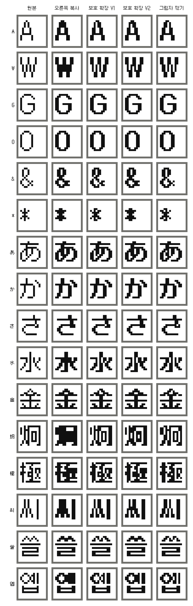

+++
title = "비트맵 폰트 볼드 알고리즘 비교"
date = 2026-09-07
+++

비트맵 폰트의 볼드 처리는 기존 픽셀을 기준으로 새 픽셀을 추가하는 방식으로 만들 수 있습니다.
여기서는 오른쪽 방향으로 픽셀을 확장하는 네 가지 방식을 비교합니다.

- **오른쪽 복사**: 모든 픽셀을 오른쪽으로 한 칸 더합니다.
- **보호 확장 V1**: 오른쪽 복사를 기본으로 하되, 복사하지 않을 픽셀을 정해 내부 공간을 보존합니다.
- **보호 확장 V2**: V1에서 보존하던 틈이라도 대각선 흐름이 있으면 복사를 허용합니다.
- **그림자 깎기**: 오른쪽 복사 후, 새로 생긴 픽셀의 오른쪽을 그림자로 보고 제거합니다.

## 1. 오른쪽 복사



가장 직관적인 방식입니다. 모든 픽셀을 오른쪽으로 한 칸 복사합니다.

```python
def simple_right_copy(pixels):
    return pixels | {(x + 1, y) for x, y in pixels}
```

## 2. 보호 확장 V1



보호 확장은 오른쪽 복사를 하되, 다음과 같은 조건에서는 복사를 생략합니다.

1. 복사하려는 오른쪽 칸에 이미 픽셀이 있는 경우
2. 복사하려는 칸의 바로 오른쪽에도 픽셀이 있어, 한 칸짜리 틈이 막히는 경우

두 번째 조건은 가까운 획 사이의 한 칸짜리 틈을 보존하기 위한 규칙입니다. 현재 픽셀과 두 칸 오른쪽 픽셀이 같은 줄에 있으면, 그 사이 빈칸을 채우지 않습니다. 이렇게 하면 떨어져 있던 두 획이 볼드 처리 때문에 붙어버리는 일을 줄일 수 있습니다.

```python
def guarded_right_expansion(pixels):
    bold = set(pixels)
    for x, y in pixels:
        if should_skip_right_pixel(pixels, x, y):
            continue
        bold.add((x + 1, y))
    return bold


def should_skip_right_pixel(pixels, x, y):
    if (x + 1, y) in pixels:
        return True

    if (x + 2, y) in pixels:
        return True

    return False
```

## 3. 보호 확장 V2

V2는 V1보다 조금 더 적극적인 변형입니다. 두 칸 오른쪽에 픽셀이 있으면 기본적으로는 복사하지 않지만, 복사하려는 위치의 위아래 대각선에 픽셀이 있으면 그 틈을 대각선 획의 흐름으로 보고 복사를 허용합니다.

```python
def guarded_right_expansion_v2(pixels):
    bold = set(pixels)
    for x, y in pixels:
        if should_skip_right_pixel_v2(pixels, x, y):
            continue
        bold.add((x + 1, y))
    return bold


def should_skip_right_pixel_v2(pixels, x, y):
    if (x + 1, y) in pixels:
        return True

    if (x + 2, y) in pixels:
        has_diagonal_bridge = any(
            (x + 1, y + dy) in pixels
            for dy in (-1, 1)
        )
        if not has_diagonal_bridge:
            return True

    return False
```

V2는 곡선이나 대각선이 많은 글자에서 더 자연스러울 수 있습니다. 대신 픽셀 간격이 촘촘한 작은 글자에서는 안쪽 틈까지 획의 일부로 판단해 과하게 채울 수 있습니다. 그래서 V1의 단순한 틈 보존과 V2의 대각선 연결 허용은 어느 쪽이 항상 더 좋다기보다, 글자의 구조에 따라 선택해야 하는 서로 다른 기준에 가깝습니다.

## 4. 그림자 깎기



그림자 깎기는 오른쪽으로 복사한 뒤, 새로 생긴 픽셀의 오른쪽을 "그림자"로 보고 그림자 부분의 픽셀을 제거합니다.

```python
def shadow_pruned_expansion(pixels):
    shifted = {(x + 1, y) for x, y in pixels}
    solid = pixels | shifted

    new_pixels = solid - pixels
    shadow = {(x + 1, y) for x, y in new_pixels}

    return solid - shadow
```

## 실제 글리프 비교

아래 이미지는 12px 비트맵 글리프 몇 개에 대해 원본, 오른쪽 복사, 보호 확장 V1, 보호 확장 V2, 그림자 깎기를 나란히 나타낸 것입니다.


